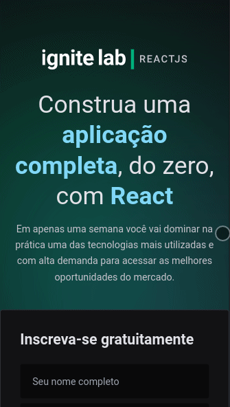

<div align="center">

</div>
<h2 align="center">
  Uma plataforma de eventos online!
</h2>

## 🚀 Tecnologias
-  React
-  Typescript
-  Tailwind CSS
-  Headless CMS (Content Management System) with GraphCMS
-  Apollo Client and Graphql Codegen
-  Vite

## Funcionalidades
- Cadastro de alunos via GraphQl
- Visualizar aulas disponíveis
- Redirecionamento caso a aula ou link seja inválido
- Loading
- Versão desktop e Mobile
- Bloquear acesso a aulas ainda não disponibilizadas

## ✨ Descrição

Trata-se de uma plataforma de eventos com a inscrição dos alunos e a disponibilização dos conteúdos conforme uma data programada. As aulas podem ser tanto lives quanto aulas práticas gravadas.

O projeto foi desenvolvido durante a o "Ignite Lab - React" da Rocketseat.

## 🌟 Preview
- Confira abaixo o preview da versão Desktop


- Confira abaixo o preview da versão Desktop


</p>

## 💻 Como instalar e rodar o projeto

Para funcionar, é nescessário criar uma conta no GraphCMS e clonar o projeto já criado, para isso acesse: [link](https://app.graphcms.com/clone/1d7442bf5a434389904c44d54a041b01?name=Ignite%20Lab%2002)

Depois de clonar copie o arquivo '.env.example' e substitua as váriaveis pelas suas do GraphCMS

Após isso basta rodar:

```cl
  npm install
  npm run dev
```

## 🔖 Layout

O layout no figma do projeto pode ser visualizado e clonado [aqui](https://www.figma.com/community/file/1120711251998877938).